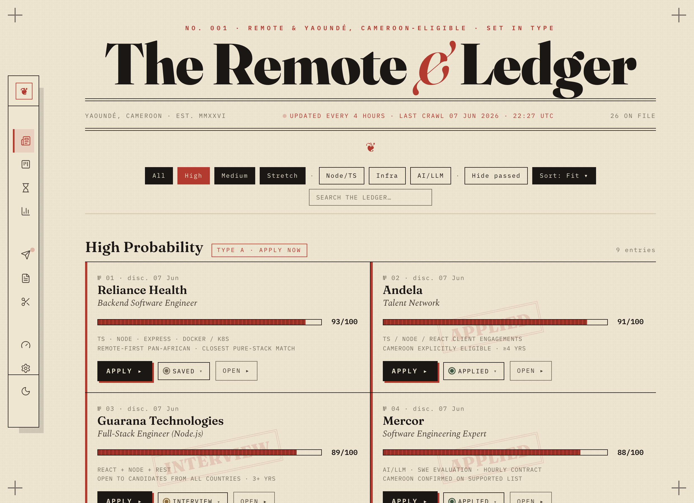
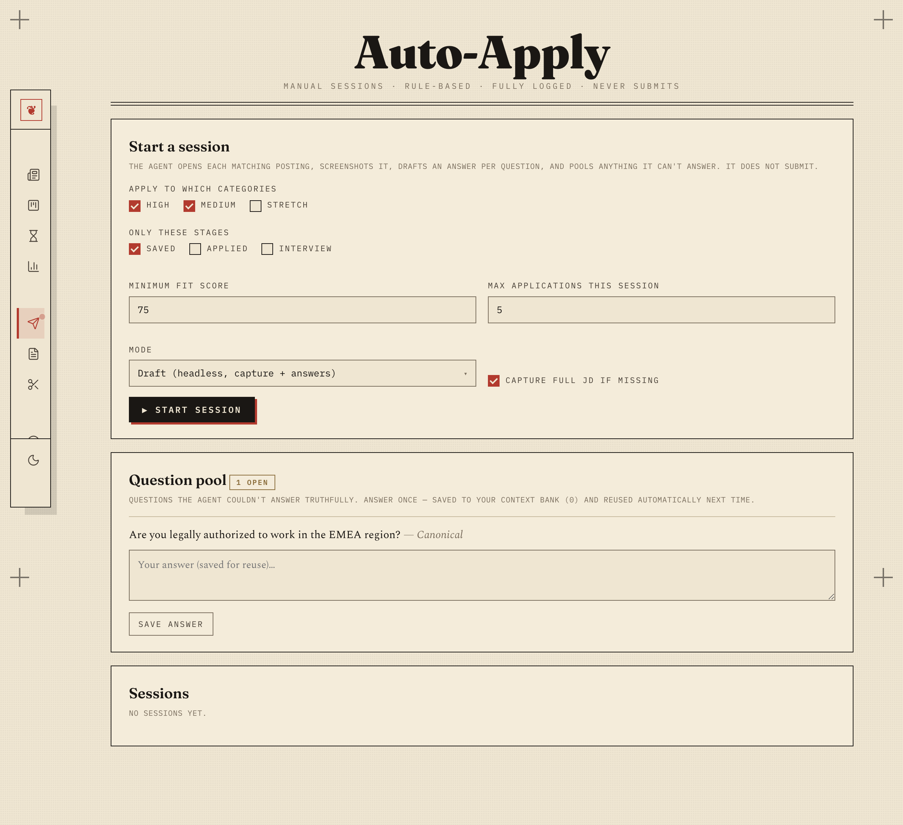
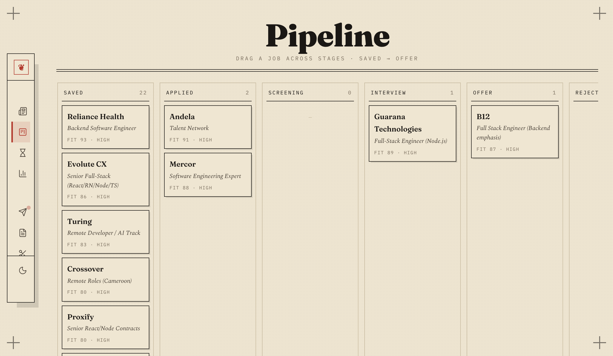
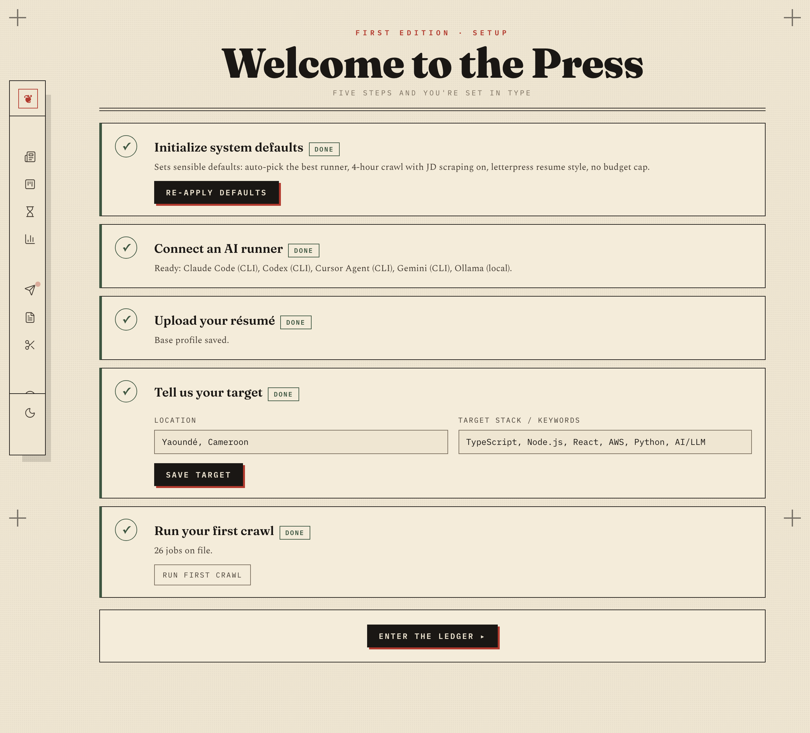
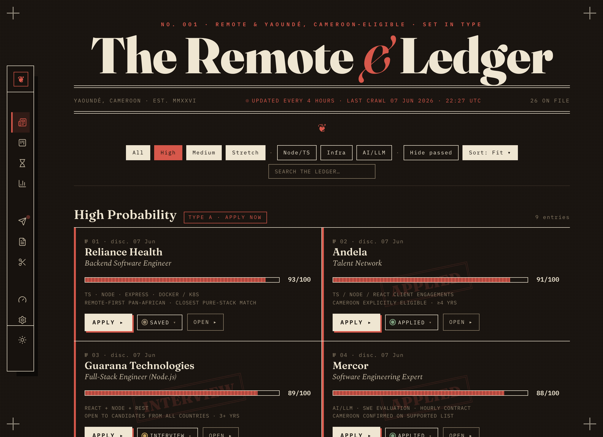

# The Remote &amp; Ledger

Your job hunt, printed like a newspaper — and worked like a copilot.

A **local-first, open-source** job-application tool you run on your own machine. It
crawls remote roles into SQLite, tailors your résumé per job with **your own AI**
(an existing CLI subscription *or* your own API keys), generates downloadable PDFs,
and tracks the whole pipeline — rendered as a hand-set **Heritage Press** broadsheet.

**Privacy is the point:** your data and keys never leave your machine. The only thing
that goes out is the call to the AI provider you chose.



<table>
  <tr>
    <td width="50%"></td>
    <td width="50%"></td>
  </tr>
  <tr>
    <td width="50%"></td>
    <td width="50%"></td>
  </tr>
</table>

<sub>The ledger · Auto-Apply room · pipeline · onboarding · Night Press. Heritage Press design system: Fraunces / Spectral / IBM Plex Mono — see [DESIGN.md](DESIGN.md).</sub>

---

## Quick start

```bash
npm install          # installs deps + Playwright Chromium (for résumé PDFs)
npm run seed         # optional: load starter jobs
npm run dev          # http://localhost:5173
```

Then open **/setup** and do three things: connect an AI runner, upload your résumé,
set your location. That's it.

## What it does

- **Ledger** (`/`) — broadsheet of jobs in High / Medium / Stretch, animated fit
  meters, filter / sort / search, quick stage dropdown, Night Press mode.
- **Job page** (`/jobs/:id`) — **rich auto-scraped JD** (the posting's own HTML, reskinned
  to Heritage Press — not flat text), **match & gap** analysis, **tailor a résumé** (4 styles
  incl. ATS-plain) with an **anti-hallucination guard** + downloadable PDF, **cover letter**,
  **interview prep**, **auto-apply assist** (ATS-aware: fills identity fields + uploads résumé +
  cover, and **auto-generates the résumé PDF / cover letter if the form requires them and you
  don't have one yet** — you submit), stage + reminders, full **history**. Every AI action
  streams in the Crawl Shell.
- **Crawl Shell** (`/crawl`) — the single place to watch all background AI work stream live
  (job crawls, JD scrapes, folder scans, email syncs, résumé/cover/match/prep) and replay any
  past run. Crawls can stop on a **time budget** *or* a **goal** ("run until N verified jobs").
- **Auto-Apply** (`/apply`) — manual, rule-based sessions that screenshot each posting, draft an
  answer per form question, and **pool anything they can't answer** for you to answer once (saved
  to a reusable context bank). **Re-verifies every link is still live before acting** — a closed
  posting is marked closed, never auto-filled. Runs in the background; never submits.
- **Knowledge Base** (`/knowledge`) — keep building your résumé from what you've worked on:
  describe a project, or **scan a folder server-side** (no upload) and the runner reads
  README/manifests/source, drafts factual bullets, and asks clarifying questions. An
  **interactive force-directed graph** (canvas + SVG engines) maps you ↔ skills ↔ projects ↔
  jobs ↔ companies ↔ stages ↔ recruiter contacts.
- **Application Mail** (`/inbox`) — connect a **dedicated job mailbox (IMAP, read-only)**; it
  classifies recruiter/ATS mail (sandboxed, never acts on email content), proposes pipeline
  stage moves you approve, sets interview reminders, and **harvests job-alert links into the
  ledger** (each verified to a live employer page). Opt-in auto-apply for high-confidence moves.
- **Pipeline** (`/board`) — drag jobs across fixed-height, per-column-scrolling stages
  (Saved → Offer). Jobs you've engaged stay here even if the posting later closes — so you can
  always follow up.
- **Expired** (`/expired`) — deadlines watched; expired roles leave the ledger automatically.
- **Archive** (`/archive`) — found jobs that went inactive (cleared by an old crawl or marked
  closed when a link died); search and **restore** any back to the ledger.
- **Analytics** (`/analytics`) — funnel, conversion rates, by-source, reminders.
- **Usage** (`/usage`) — every AI call's tokens + cost, by purpose / runner, monthly budget.
- **Résumés** (`/resume`) — upload PDF → structured profile(s); multiple personas; a list of
  every **job-tailored résumé** generated (with match score + PDF); and a floating **AI assistant**
  to edit your résumé structure by chat.
- **Clipper** (`/clipper`) — bookmarklet + browser extension to save any job page.
- **Settings** (`/settings`) — runners, BYO keys, prompt, scheduler (time-budget or goal-count),
  budget, profile.

First run lands on a short **onboarding wizard** (`/setup`) that sets sensible defaults,
connects a runner, takes your résumé, and asks for your location + target stack — the app
ships with **no personal data baked in**.

## Bring your own AI (two ways)

| Family | Examples | Auth | Cost |
|---|---|---|---|
| **Agent CLI** | Claude Code, Codex, Cursor, Gemini | your subscription | tracked, billed as subscription |
| **Direct API** | Anthropic, OpenAI, Google, OpenRouter, Groq, Mistral, Ollama (local) | **your key** | exact tokens × `pricing.json` |

Keys are stored **encrypted** on your machine (AES-256-GCM, local master key) or via
env vars. Auto-detected runners show up in Settings; pick a default + fallback.
Token & cost of every call land on **/usage**, with a monthly budget cap.

## Crawling for jobs

The **built-in scheduler** runs while the app is open (interval in Settings). For
background runs, install an OS schedule (auto-detects paths, no hardcoding):

```bash
npm run crawl                 # run one crawl now (CLI)
npm run scheduler install 4   # OS schedule every 4h (launchd/systemd/Task Scheduler)
npm run scheduler status
npm run scheduler uninstall
```

Crawling needs web access, so it works best with a CLI runner that has web search
(e.g. Claude Code). Personalize what it looks for in **Settings → Job-search prompt**
(uses `{{location}}` and `{{stack}}`). After each crawl the engine **scrapes the full
job description** from every new posting (Playwright, SPA-aware) and saves it — toggle
this and the per-crawl cap in **Settings → Scheduler**.

## Résumé tailoring

Upload your PDF once (`/resume`) → parsed into structured JSON. Per job, the runner
reorders/rewords it to match — **never inventing** employers, titles, or metrics; a
guard flags anything new and shows a diff of what changed. Render to **Letterpress /
Modern / Compact / ATS-plain** and download the PDF.

## Configuration

| Where | What |
|---|---|
| `/settings` | runners, BYO keys, models, budget, scheduler, profile, prompt |
| `pricing.json` | per-model token prices (edit freely) |
| `.env` | optional key/path overrides (see `.env.example`) |
| `DESIGN.md` | the Heritage Press design system |

## Docker

```bash
docker compose up --build      # http://localhost:5173, data persisted in ./data
```

## Project layout

```
app/
  sqlite.server.ts   secrets.server.ts   db.server.ts
  llm/      types · adapters · runner · pricing
  resume/   profiles · ai · templates · pdf · versions · types
  services/ crawl · scheduler · scrape · apply · apply-session · kb · graph · email
  routes/   home settings usage resume knowledge inbox job board analytics
            expired archive setup clipper  api-crawl api-clip api-pending api-dirs version-pdf
  components/ Shell Nav Sidebar Select FilePicker DirPicker ConfirmForm ResumeChat
              graph/ (GraphView · ForceCanvas · SvgForce · palette)
scripts/    run-crawl.ts os-scheduler.mjs seed.mjs schema.sql prompt.md
extension/  MV3 browser clipper
pricing.json  DESIGN.md  ROADMAP.md
```

## Tech

React Router 7 (SSR) · better-sqlite3 · Playwright · pdf-parse · ImapFlow + mailparser
(read-only email) · d3-force + react-force-graph (knowledge graph) · lucide-react ·
TypeScript · zero telemetry.

MIT licensed — see [LICENSE](LICENSE) and [CONTRIBUTING.md](CONTRIBUTING.md).
